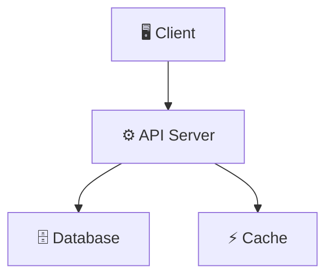
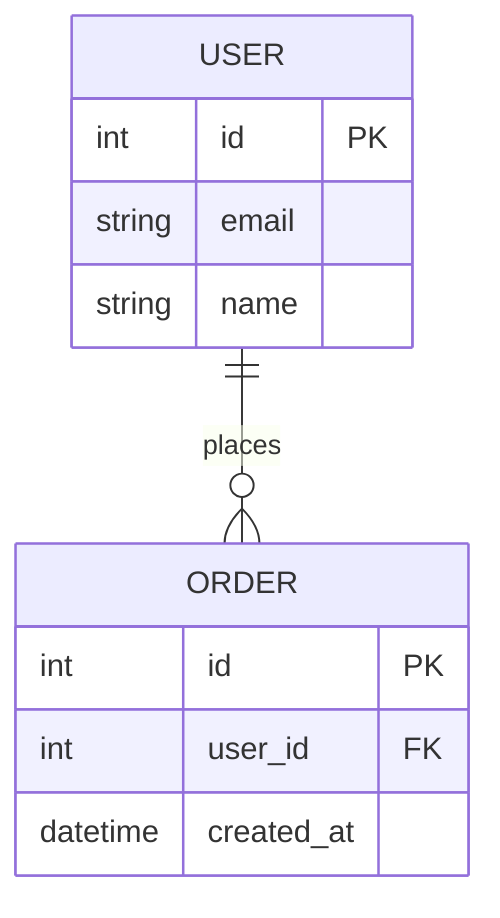

# 🏗 Архитектура — Wiki

> Обновлено: 2026-02-24

## Высокоуровневая диаграмма



[TODO: Адаптировать диаграмму под проект]

## Тип архитектуры

[TODO: Монолит / Микросервисы / Serverless / Гибрид]

## Структура директорий

```
[TODO: Заполнить после определения стека]
```

## Основные модули

| Модуль | Ответственность | Зависимости |
|--------|----------------|-------------|
| [TODO] | [TODO] | [TODO] |

## Модель данных



[TODO: Адаптировать под проект]

## API контракты

### Основные эндпоинты

| Метод | Путь | Описание | Auth |
|-------|------|----------|------|
| [TODO] | [TODO] | [TODO] | [TODO] |

## Аутентификация

[TODO: JWT / OAuth / Session — описание flow]
