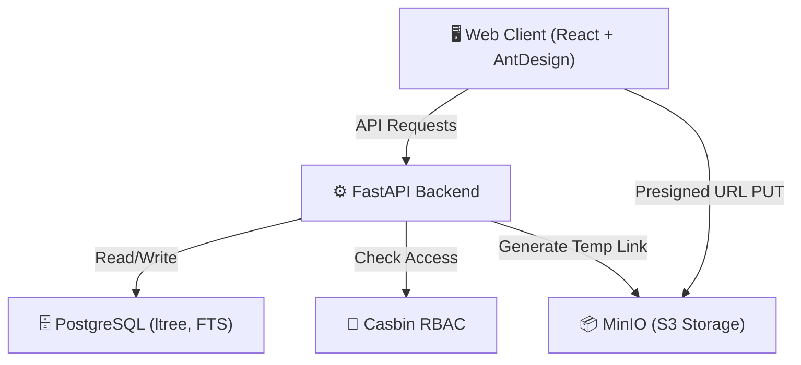
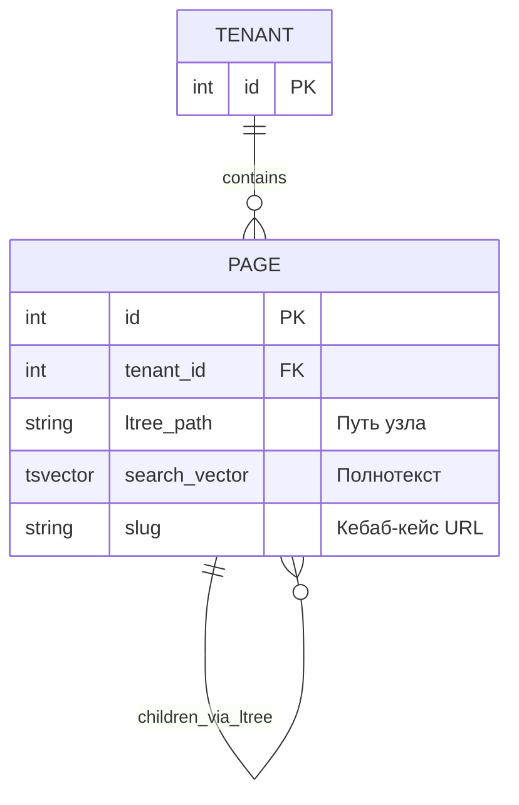

# 🏗 Архитектура — Wiki

> Обновлено: 2026-02-24

## Высокоуровневая диаграмма

## Тип архитектуры

Монолитное ядро (FastAPI) с раздельным хранением объектов в S3. Используется **Isolated Schema Multi-Tenancy** (одна база данных, изолированные схемы (schema) для каждого арендатора). Контекст арендатора (tenant) определяется динамически через Middleware.

## Структура директорий
Определяется в последующих фазах (frontend + backend codebases).

## Основные модули

| Модуль | Ответственность | Зависимости |
|--------|----------------|-------------|
| Middleware/Auth | Определение Tenant ID, JWT-проверка. | Pydantic, FastAPI. |
| RBAC (Casbin) | Определение ролей (роли, привязанные к Tenant). | sqlalchemy, pycasbin. |
| Pages Tree | Операции CRUD с \`ltree\`, построение иерархии (до 4 ур.). | PostgreSQL \`ltree\`. |
| Search | Полнотекстовый поиск с гибридной фильтрацией. | Postgres FTS (\`tsvector\`). |
| Media S3 | Генерация временных ссылок (Presigned URL) для загрузки/чтения медиа файлов. | boto3 / minio. |

## Модель данных (Ключевые сущности)

## API контракты

### Основные эндпоинты

| Метод | Путь | Описание | Auth |
|-------|------|----------|------|
| GET | \`/api/v1/pages\` | Получить всё дерево страниц текущего tenant (treeData) | Да |
| GET | \`/api/v1/pages/{{slug}}\` | Чтение конкретной документации | Да / Публ.Токен |
| POST | \`/api/v1/media/upload-url\` | Получить Presigned URL MinIO | Да |

## Авторизация
JWT Bearer 토кены. Разделение прав осуществляется с помощью Casbin pycasbin (Домены: tenant1, Роли: admin, editor, viewer).
